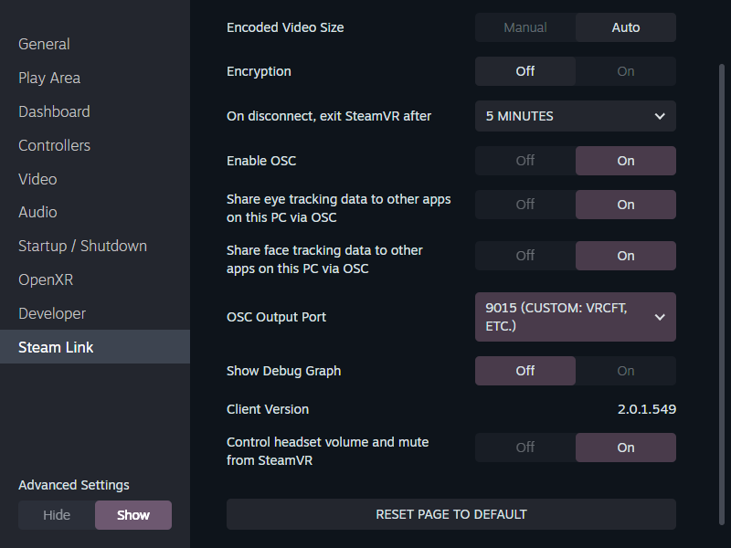

# SteamLink Module for VRCFT

The Implementation is **EXPERIMENTAL** and may change without notice causing app to fail.

## Install

- Download Latest Release from [Releases](https://github.com/ykeara/LinkFT/releases/latest)
- In VRCFT go to modules and install from zip


## Setup

- **DO NOT CHANGE VRCFT NETWORK SETTINGS**

- In VR you will need to change a few settings in SteamLink, you will need to have "Advanced Settings" to show
  - Enable OSC - on
  - Share eye tracking data... - on
  - Share Face tracking data... - on
  - OSC Output Port - 9015 (Custom: VRCFT,Etc.)

## Mixed Tracking / 混合追踪

This module automatically cooperates with other VRCFT tracking modules to avoid overlapping data:

- When another module's **face tracking** is already active (initialized first), this module only claims **eye tracking**. VRCFT's main page will show "Eye Tracking Active" without "Expression Tracking Active", and this module will stop writing expression data.
- When another module's **eye tracking** is already active, this module only claims **expression tracking** (and vice versa).
- The claim is decided by the handshake with VRCFT during module initialization. Module load order (by module folder name) determines which module claims first.

### Manual override (tracking_config.json)

Because load order is alphabetical by module folder (effectively random), this module may load **before** another face tracking module and claim everything. In that case, create/edit the config file next to the module DLL:

`%APPDATA%\VRCFaceTracking\CustomLibs\2a8c8080-2a76-46af-bf76-1da7c0127ef8\tracking_config.json`

```json
{
  "EyeTracking": "Auto",
  "FaceTracking": "Off"
}
```

Values (case-insensitive):

| Value | Behavior |
|---|---|
| `Auto` | Follow VRCFT handshake: claim only what no other module has claimed (default) |
| `On` | Always claim this tracking type |
| `Off` | Never claim this tracking type (let other modules take it) |

Example: with another face tracking module installed, set `FaceTracking` to `Off` so SteamLink only provides eye tracking. Restart VRCFT after changing the config.

The config file is created automatically with defaults on first launch.

Note: toggling this module off on VRCFT's main page pauses its data output until toggled back on.


